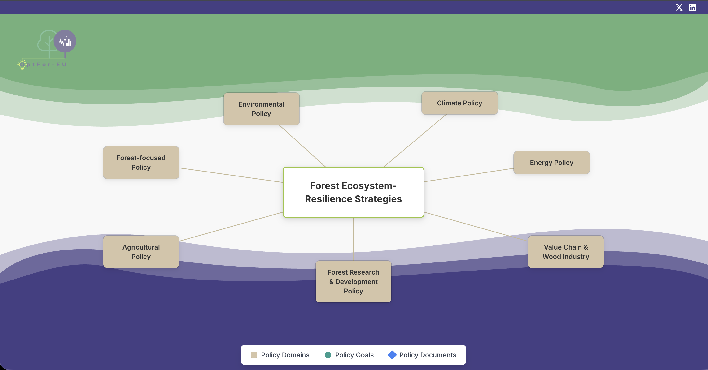
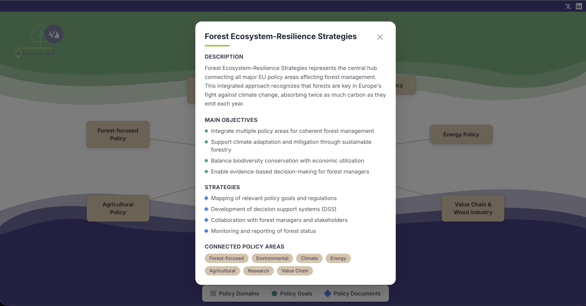
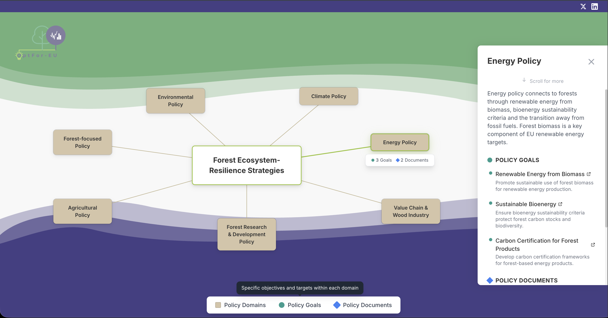
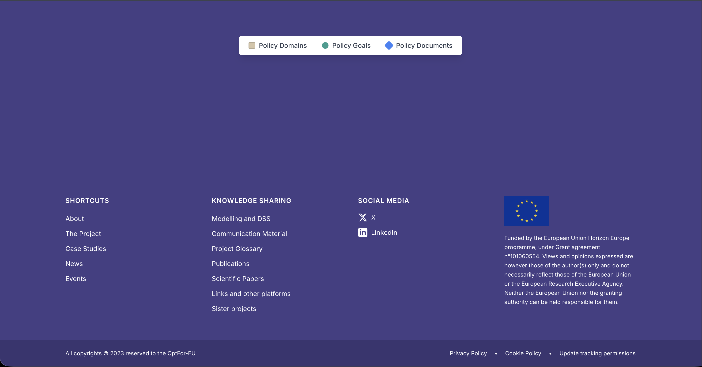

<div align="center">
  

  # OptFor-EU — Interactive Forest Policy Visualization

  An interactive web application that maps European Union forest policy domains,
  built for the OptFor-EU Horizon Europe research project.

  [](https://react.dev)
  [](https://www.typescriptlang.org)
  [](https://vitejs.dev)
  [](https://tailwindcss.com)
  [](https://research-and-innovation.ec.europa.eu/funding/funding-opportunities/funding-programmes-and-open-calls/horizon-europe_en)
</div>

---

## What is this?

This application is an interactive visualization tool developed for the **OptFor-EU** project — a European Union Horizon Europe research initiative focused on optimizing forest ecosystem resilience strategies across Europe.

EU forest management is shaped by many overlapping policy frameworks that are often developed in isolation. This tool makes those connections visible and explorable — turning a complex policy landscape into a clear, interactive map that researchers, policymakers, and forest managers can navigate.

---

## Screenshots

### The Interactive Map
The main view — seven policy domain boxes connected to the central node. Click any box to explore it.



---

### Central Node — Forest Ecosystem-Resilience Strategies
Clicking the center node opens a popup with a full overview of objectives, strategies, and connected policy areas.



---

### Policy Domain Detail Panel
Clicking a domain box slides in a detail panel showing policy goals and official EU documents, each linking to the real source.



---

### Footer
The footer matches the official OptFor-EU website design with navigation links, social media, and the EU funding disclaimer.



---

## Tech Stack

| Tool | Purpose |
|---|---|
| React 18 + TypeScript | UI framework with type safety |
| Vite | Build tool and development server |
| Tailwind CSS | Utility-first styling |

No backend. No database. The entire application compiles to three static files.

---

## Project Structure

```
src/
├── components/
│   ├── decorations/           # Wave decorations between sections
│   ├── App.tsx                # Root layout and state
│   ├── Header.tsx             # Top bar and logo
│   ├── Footer.tsx             # Site footer
│   ├── PolicyMap.tsx          # The interactive map
│   ├── PolicyDomainBox.tsx    # Clickable domain boxes
│   ├── DetailPanel.tsx        # Right-side detail panel
│   ├── CentralNodeModal.tsx   # Center node popup
│   ├── Legend.tsx             # Symbol key
│   ├── PolicyGoalItem.tsx     # Goal row in detail panel
│   └── PolicyDocumentItem.tsx # Document row in detail panel
├── data/
│   └── policyData.ts          # All policy content — edit text here
├── types/
│   └── policy.ts              # TypeScript type definitions
└── main.tsx                   # React entry point
```

> To update any text, links, or policy content — only edit `src/data/policyData.ts`. No other files need to change.

---

## Build for production

```bash
npm run build
```

Output goes to `dist/` — three optimized files ready for any web server.

---

## Funding & Disclaimer

Funded by the **European Union Horizon Europe** programme under Grant Agreement No. **101060554**.

Views and opinions expressed are those of the author(s) only and do not necessarily reflect those of the European Union or the European Research Executive Agency. Neither the European Union nor the granting authority can be held responsible for them.


---

<div align="center">
  Built for <a href="https://optforeu.eu">OptFor-EU</a> · Horizon Europe · Grant No. 101060554
</div>